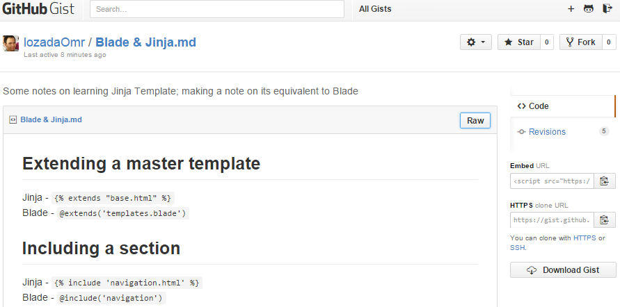

<meta charset="UTF-8">

【社外秘】

2015年xx月度グループ会議報告書

第一開発部 知識制御グループ 
溝渕創一郎 
2015年05月XX日 

PJ報告 - SW社M案件(4/xx～4/xx)
===============================================

## 現状
<ol>
	<li>○○技術に関する報告書作成
	<ul>
		<li>関連文献の調査
		<li>○○技術の特徴をまとめた報告書の作成
	</ul>
	<li>既存システムBの動作確認、環境確認
	<li>開発環境の構築
	<ul>
		<li>開発に使用する開発環境のセットアップ
		<li>Visual Studio 2013
		<li>Python
		</li>ほか
	</ul>
</ol>

## 課題  

0. ○○技術の不明点の追加調査
0. 既存システムBの動作環境整備

## 今後

0. ○○技術の実装
0. 既存システムBの移植

オフィス研修
================================================

グループ活動
================================================

  
付録
================================================

## Github Gist (コード片やTipsを投稿するサイト)  

## Atom (Github謹製のテキストエディタ)

aaaa  

  

aaaaa

  

aaaa
