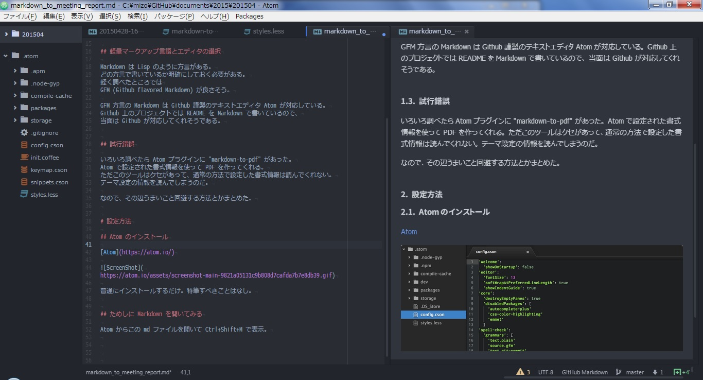

# 経緯など

## バージョン管理で文面の更新履歴を残したい

なんでマークアップ言語で書くの？というと、
Word が嫌いなのもあるけど、編集履歴見れないのが嫌だから。
latex や HTML + CSS も検討したけれど、
こっちは書式情報が多すぎて編集時の視認性が良くない※。  
※実際に勉強して書いてみたけどだるかった

というわけで、かっちりしたマークアップ言語でなく、
Markdown や reST みたいな軽量系で書く方法を調べた。


## 軽量マークアップ言語とエディタの選択

Markdown は Lisp のように方言がある。
どの方言で書いているか明確にしておく必要がある。
軽く調べたところでは
GFM (Github flavored Markdown) が良さそう。

GFM 方言の Markdown は Github 謹製のテキストエディタ Atom が対応している。
Github 上のプロジェクトでは README を Markdown で書いているので、
当面は Github が対応してくれそうである。


## 試行錯誤

いろいろ調べたら Atom プラグインに "markdown-pdf" があった。
Atom で設定された書式情報を使って PDF を作ってくれる。
ただこのツールはクセがあって、通常の方法で設定した書式情報は読んでくれない。
テーマ設定の情報を読んでしまうのだ。

なので、その辺うまいこと回避する方法とかまとめた。


# 設定方法

## Atom のインストール

[Atom](https://atom.io/)


普通にインストールするだけ。特筆すべきことはなし。


## ためしに Markdown を開いてみる

Atom からこの md ファイルを開いて Ctrl+Shift+M で表示。
プレビュー設定が違うので表示が違うけど、イメージとしてはこんな感じ。




## 各種プラグインをインストールする

`Ctrl+,` で設定画面表示。
Install を選んで下記のパッケージを入れる。

* Packages
    * japanese-menu
    * japanese-wrap
    * markdown-pdf
* Themes
    * unity-ui

別にテーマは Unity でなくてもかまわない。
ただ改造するので自分が使いたいテーマじゃない方がいいかも。


## テーマ改造

`C:\Users\[ユーザ名]\.atom\packages\unity-ui\styles`  
に `markdown-to-pdf.less` をコピー。


`C:\Users\[ユーザ名]\.atom\packages\unity-ui\index.less`  
の末尾に下記の一行を追加。

```css
 @import "styles/markdown-to-pdf";
```


## ユーザースタイルの編集

`Ctrl+\` でファイルリストを表示。  
右クリック→プロジェクトフォルダを追加  
`C:\Users\[ユーザ名]\.atom` を開く。  

`styles.less` を編集する。  
とりあえず一旦 `.markdown-preview {}` の中をコメントアウトしておく。  
範囲選択して `Ctrl+/` でコメントアウト。


## PDFに出力してみる

この md ファイルをアクティブにした状態で `Ctrl+Shift+C`。
とりあえず同名拡張子違いで出力されるので出来栄えを確認する。

気が済んだら `G会議サンプル.md` でも変換してみるとよい。
